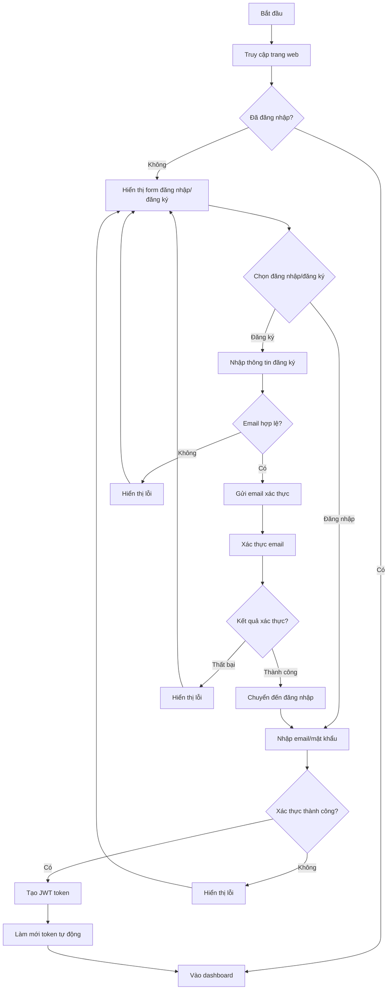
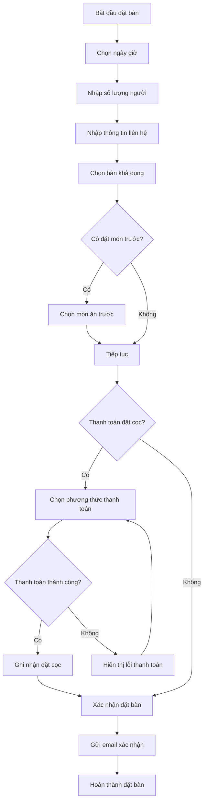
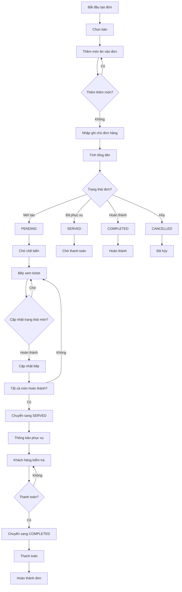
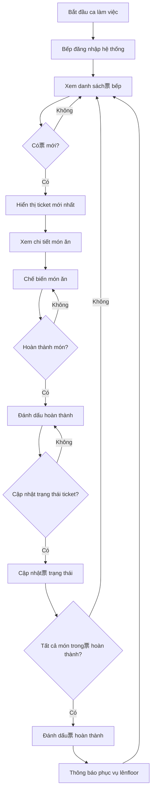
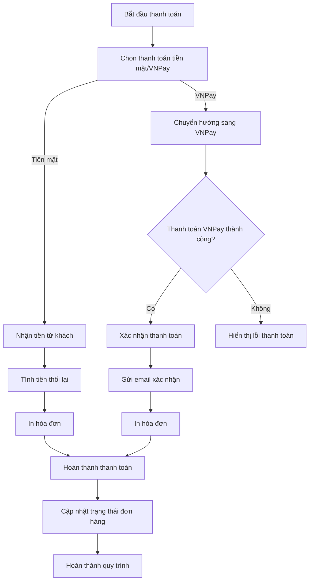
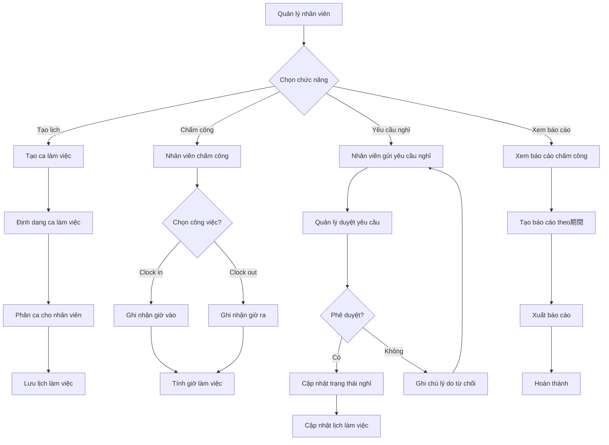
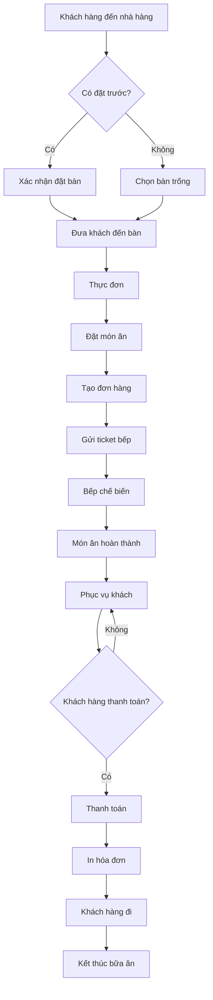
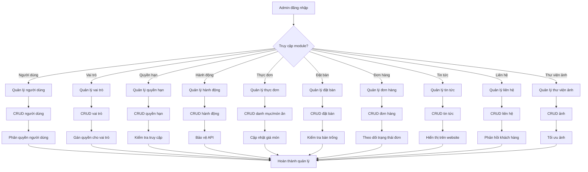
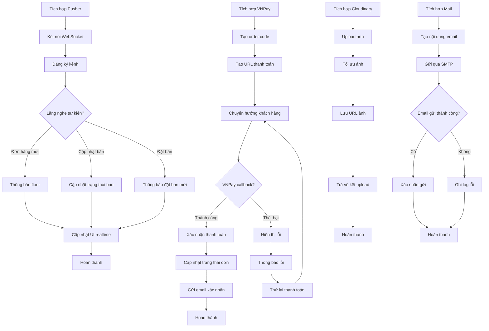
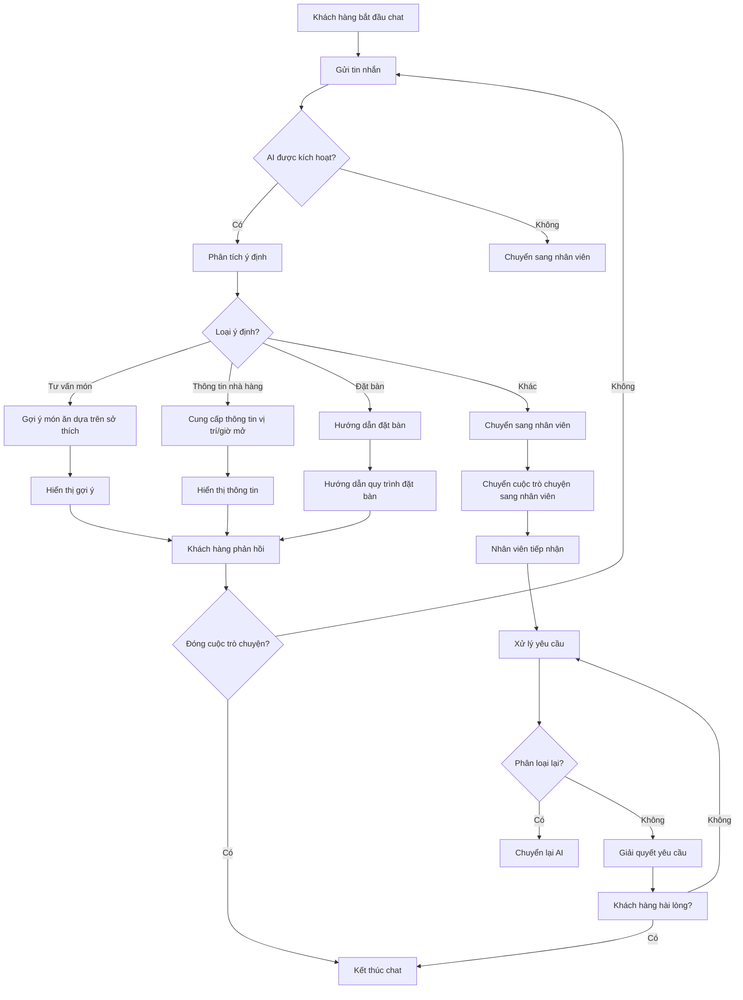

# Hoạt Đồ Hệ Thống Quản Lý Nhà Hàng

## 1. Luồng Xác Thực Người Dùng

## 2. Luồng Đặt Bàn

## 3. Luồng Quản Lý Đơn Hàng

## 4. Luồng Quản Lý Bếp

## 5. Luồng Thanh Toán

## 6. Luồng Quản lý Nhân Viên

## Luồng Toàn Diện: Khách hàng đến trả món

## Luồng Quản Lý Hệ Thống (Admin)

## Luồng Tích Hợp Thiết Bị Dịch Vụ

## Luồng AI Hỗ Trợ

> **Lưu ý**: Đây là sơ đồ hoạt động dựa trên các chức năng đã triển khai trong hệ thống quản lý nhà hàng. Mỗi luồng thể hiện các bước xử lý chính từ góc độ người dùng và quản trị viên.
