# Sơ Đồ Chức Năng Hệ Thống Quản Lý Nhà Hàng

## Sơ Đồ Tổng Quan

```mermaid
graph TD
    A[HỆ THỐNG QUẢN LÝ NHÀ HÀNG]

    A --> B[Quản Trị Hệ Thống]
    A --> C[Quản Lý Vận Hành]
    A --> D[Nhân Viên Phục Vụ]
    A --> E[Bếp]
    A --> F[Thu Ngân]
    A --> G[Khách Hàng]

    B --> B1[Quản lý người dùng]
    B --> B2[Quản lý vai trò]
    B --> B3[Quản lý quyền hạn]
    B --> B4[Quản lý hành động]
    B --> B5[Báo cáo thống kê]

    C --> C1[Quản lý tầng/khu vực]
    C --> C2[Quản lý bàn ăn]
    C --> C3[Quản lý danh mục món]
    C --> C4[Quản lý món ăn]
    C --> C5[Quản lý lịch làm việc]
    C --> C6[Quản lý tin tức]
    C --> C7[Quản lý liên hệ]
    C --> C8[Quản lý thư viện ảnh]

    D --> D1[Quản lý đặt bàn]
    D --> D2[Quản lý đơn hàng]
    D --> D3[Quản lý món trong đơn]
    D --> D4[Chấm công]

    E --> E1[Xem phiếu bếp]
    E --> E2[Cập nhật trạng thái món]
    E --> E3[Quản lý món cần làm]

    F --> F1[Xử lý thanh toán]
    F --> F2[In hóa đơn]
    F --> F3[Báo cáo doanh thu]

    G --> G1[Đăng ký/Đăng nhập]
    G --> G2[Đặt bàn online]
    G --> G3[Xem thực đơn]
    G --> G4[Chat hỗ trợ]
    G --> G5[Liên hệ]
    G --> G6[Xem tin tức]
```

## Sơ Đồ Chi Tiết Theo Module

### 1. Module Xác Thực & Người Dùng

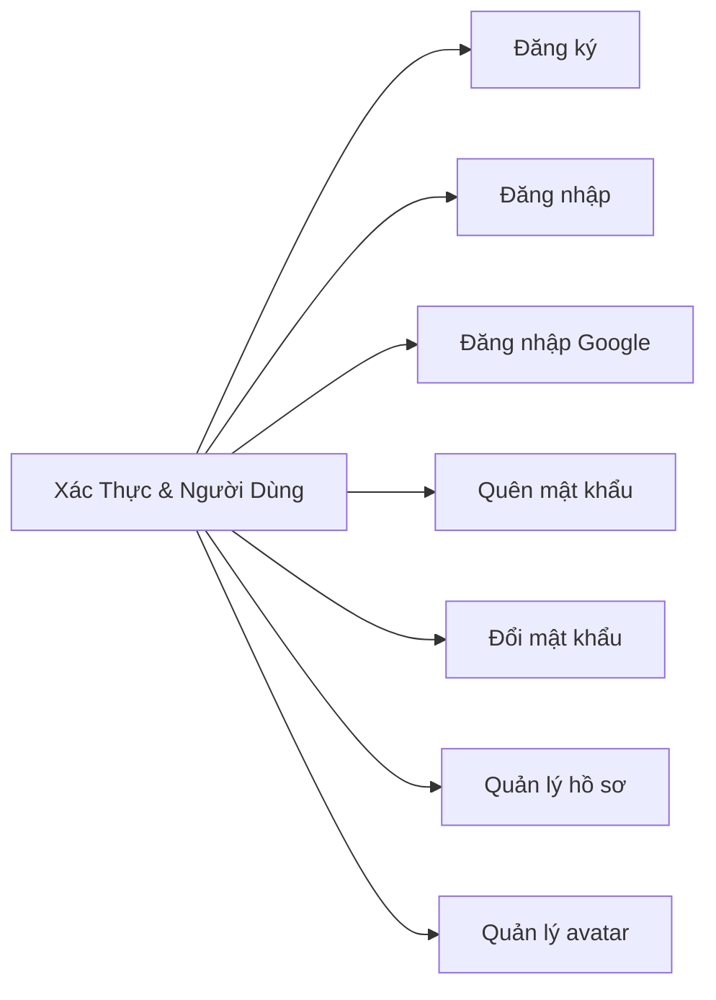

### 2. Module Phân Quyền

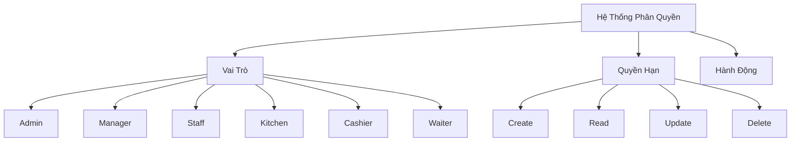

### 3. Module Quản Lý Bàn & Tầng

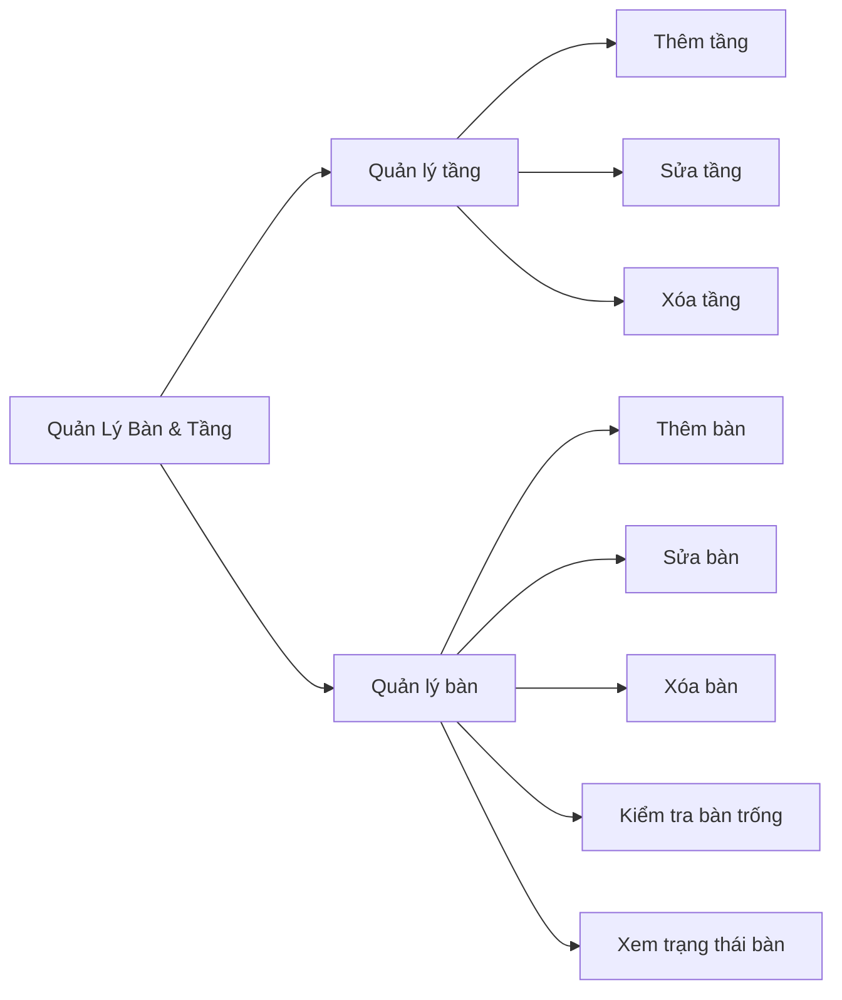

### 4. Module Thực Đơn

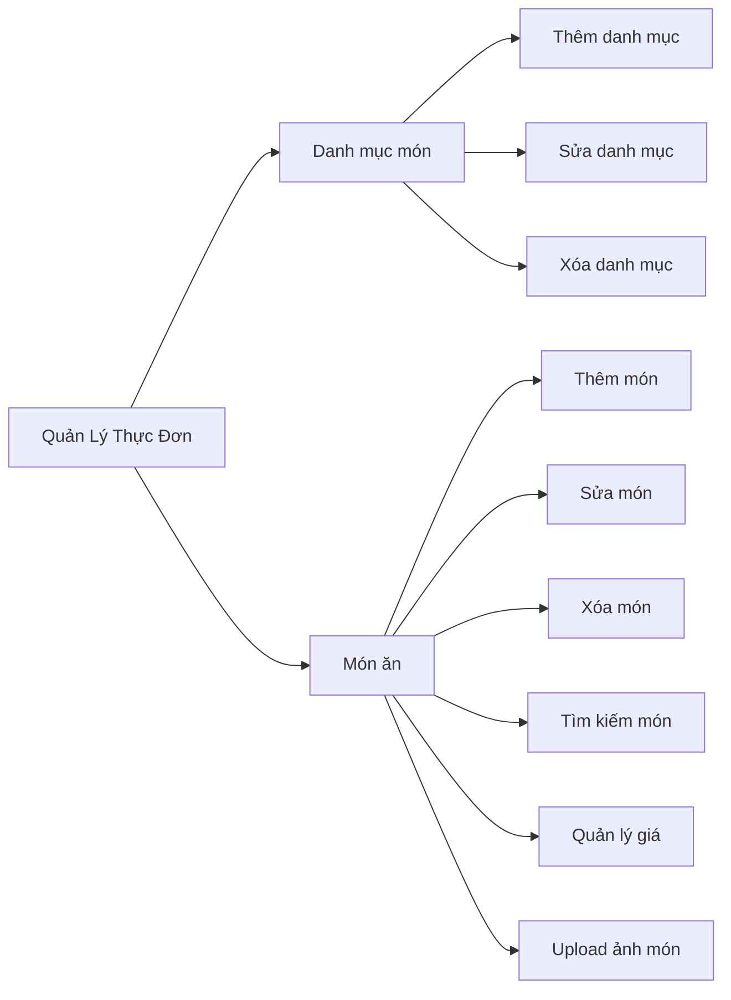

### 5. Module Đặt Bàn

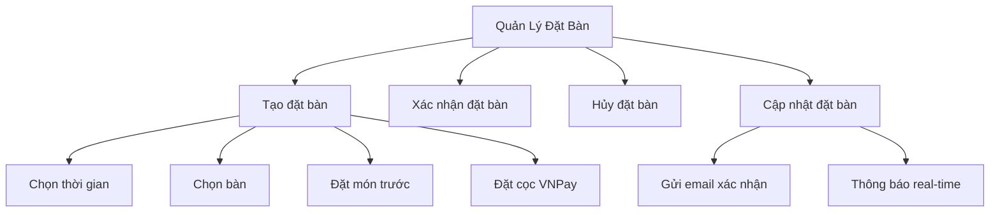

### 6. Module Đơn Hàng

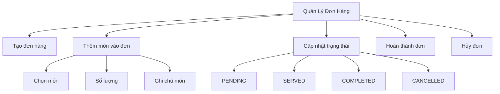

### 7. Module Bếp

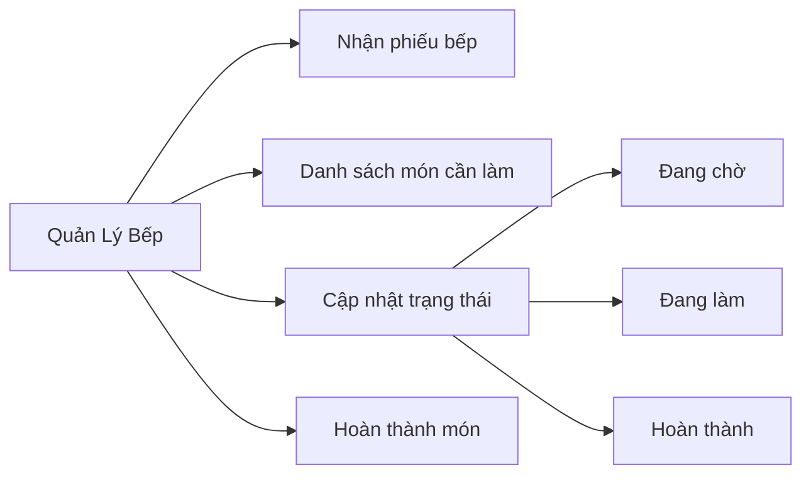

### 8. Module Thu Ngân & Thanh Toán

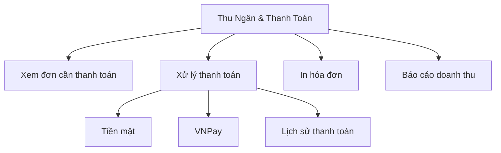

### 9. Module Nhân Viên

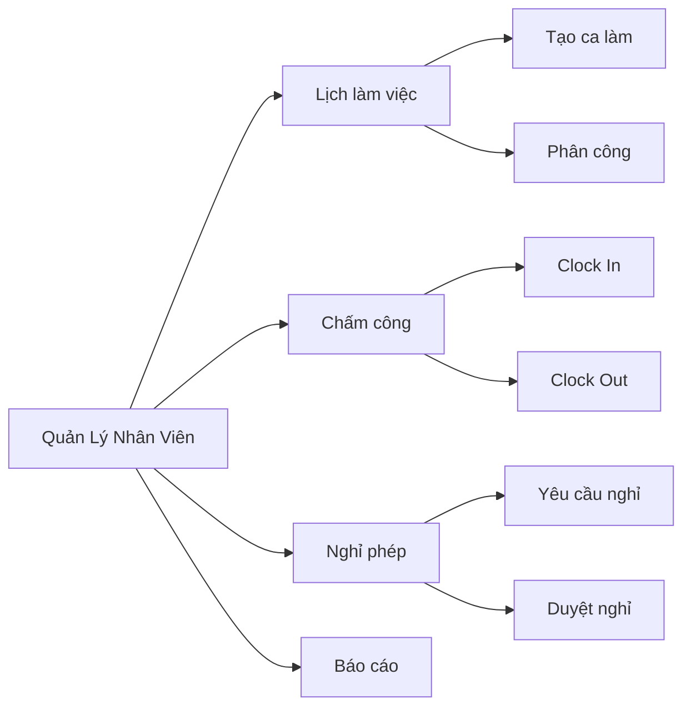

### 10. Module Nội Dung & Truyền Thông

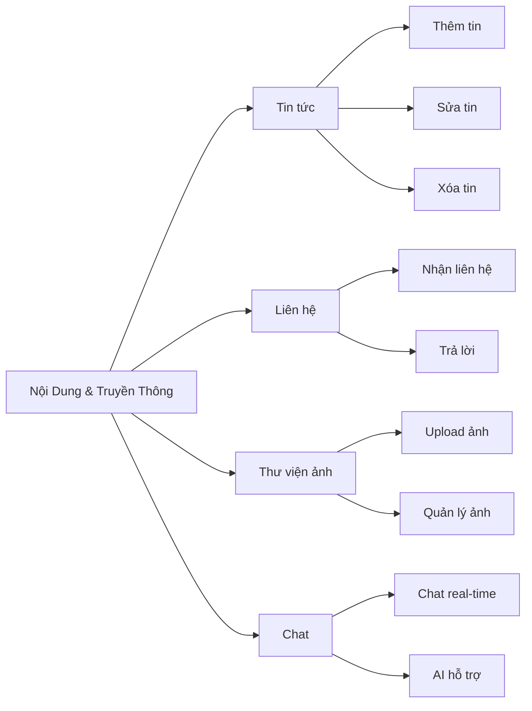

## Luồng Hoạt Động Chính

### Luồng Đặt Bàn

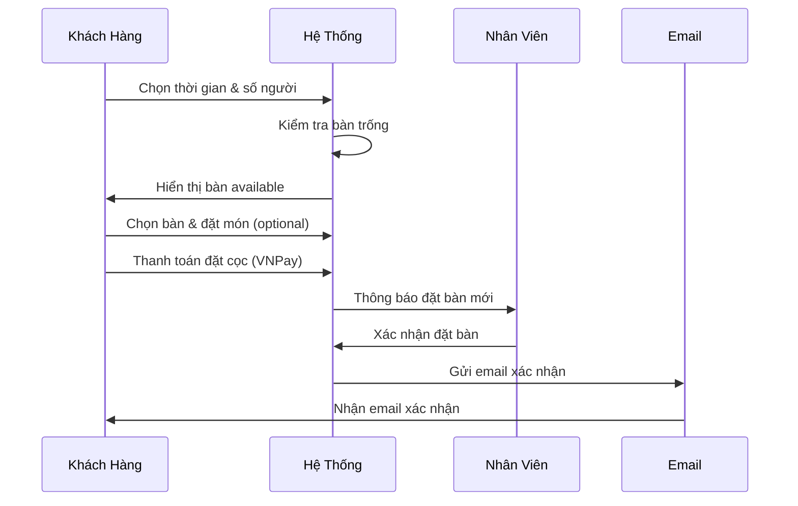

### Luồng Đơn Hàng

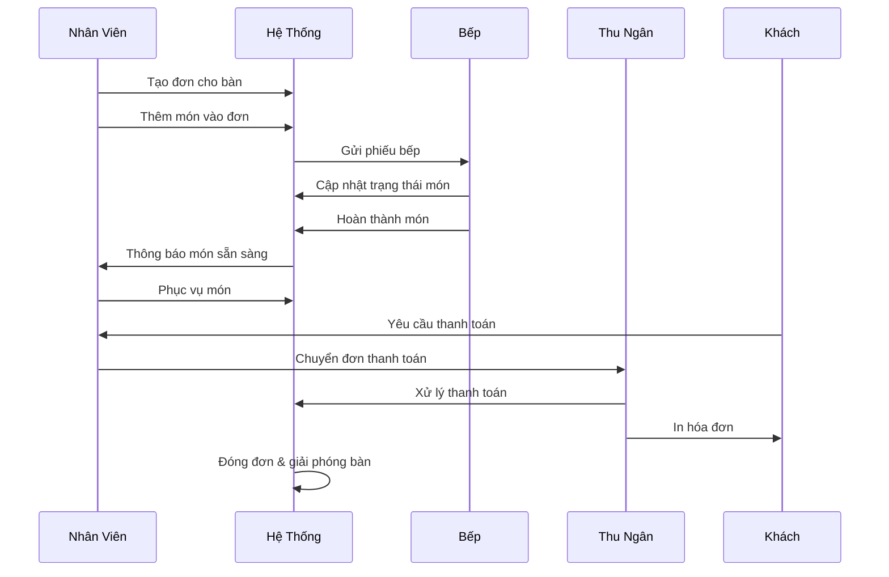

### Luồng Chấm Công

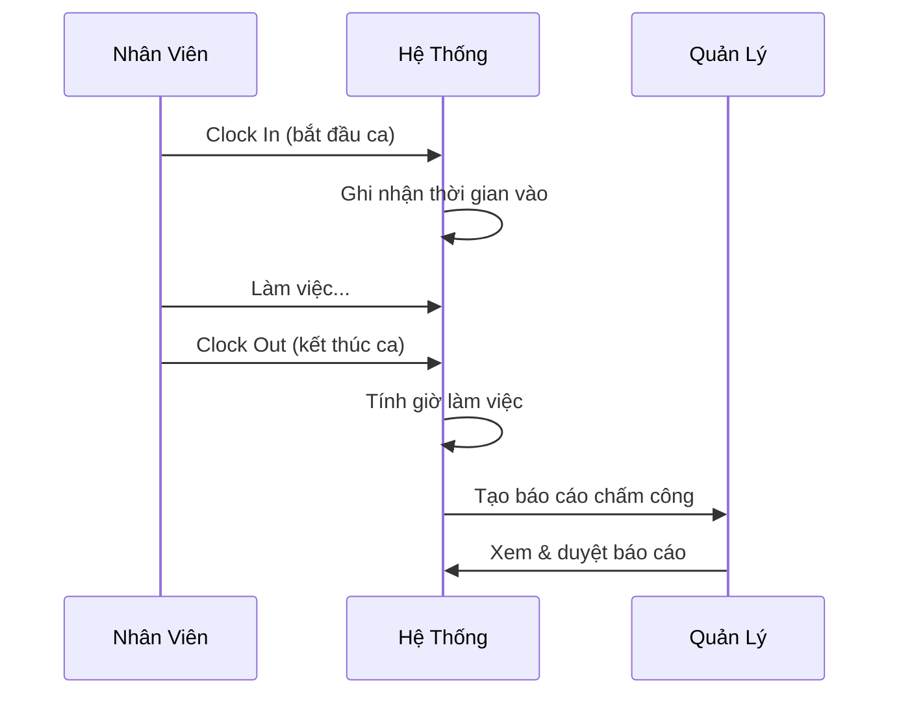

## Kiến Trúc Phân Quyền (RBAC)

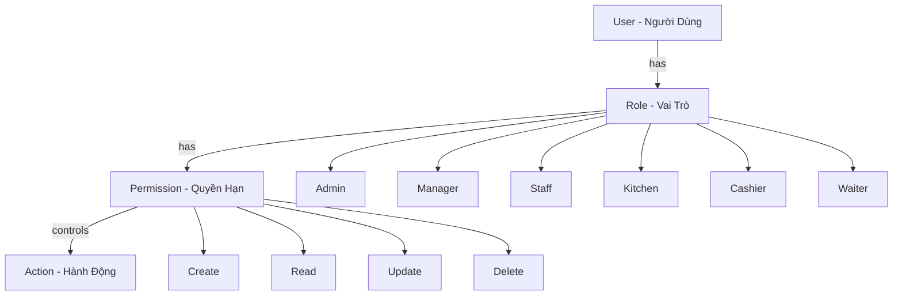

## Công Nghệ & Tích Hợp

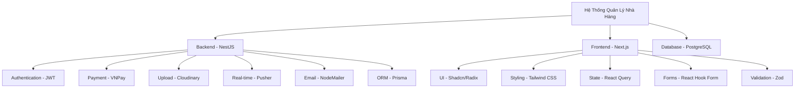

## Tổng Quan Các Module Theo Vai Trò

| Vai Trò          | Modules Được Phép Truy Cập                                                                                            |
| ---------------- | --------------------------------------------------------------------------------------------------------------------- |
| **Admin**        | Tất cả modules                                                                                                        |
| **Manager**      | Người dùng, Vai trò, Quyền hạn, Tầng/Bàn, Thực đơn, Đặt bàn, Đơn hàng, Nhân viên, Tin tức, Liên hệ, Thư viện, Báo cáo |
| **Staff/Waiter** | Đặt bàn, Đơn hàng, Món trong đơn, Bàn ăn, Thực đơn (xem), Chấm công                                                   |
| **Kitchen**      | Bếp, Phiếu bếp, Món cần làm, Chấm công                                                                                |
| **Cashier**      | Thu ngân, Thanh toán, Hóa đơn, Báo cáo doanh thu, Chấm công                                                           |
| **Customer**     | Đăng ký/Đăng nhập, Đặt bàn, Xem thực đơn, Chat, Liên hệ, Tin tức                                                      |

## Ghi Chú

- Sơ đồ được tạo bằng Mermaid để dễ dàng chỉnh sửa và bảo trì
- Các module được tổ chức theo vai trò người dùng
- Luồng hoạt động thể hiện tương tác giữa các thành phần
- Kiến trúc RBAC đảm bảo phân quyền linh hoạt và bảo mật
