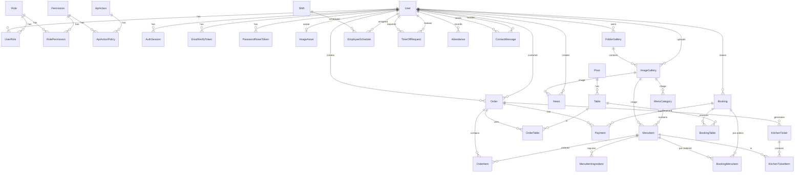

# Entity Relationship Diagram

## Giải thích các mối quan hệ

### Quản lý người dùng & phân quyền

- **User - UserRole - Role**: Người dùng có nhiều vai trò thông qua bảng trung gian UserRole
- **Role - RolePermission - Permission**: Vai trò có nhiều quyền thông qua bảng trung gian RolePermission
- **Permission - ApiActionPolicy - ApiAction**: Quyền được ánh xạ tới các hành động API

### Xác thực & bảo mật

- **User - AuthSession**: Một người dùng có nhiều phiên đăng nhập
- **User - EmailVerifyToken**: Một người dùng có nhiều token xác thực email
- **User - PasswordResetToken**: Một người dùng có nhiều token đặt lại mật khẩu

### Quản lý hình ảnh

- **User - ImageAsset**: Một người dùng có một ảnh đại diện
- **User - FolderGallery - ImageGallery**: Người dùng tạo thư mục chứa nhiều hình ảnh
- **ImageGallery - MenuCategory/MenuItem/News**: Hình ảnh được sử dụng cho danh mục thực đơn, món ăn và tin tức

### Quản lý bàn & tầng

- **Floor - Table**: Một tầng có nhiều bàn

### Quản lý đơn hàng

- **User - Order**: Người dùng tạo đơn hàng (nhân viên) và là khách hàng
- **Order - OrderItem**: Một đơn hàng có nhiều món
- **Order - OrderTable**: Một đơn hàng sử dụng nhiều bàn (many-to-many)
- **Table - OrderTable**: Một bàn có thể phục vụ nhiều đơn hàng
- **MenuItem - OrderItem**: Món ăn được đặt trong nhiều đơn hàng

### Quản lý thực đơn

- **MenuCategory - MenuItem**: Một danh mục có nhiều món ăn
- **MenuItem - MenuItemIngredient**: Một món ăn có nhiều nguyên liệu

### Quản lý đặt bàn

- **User - Booking**: Người dùng tạo nhiều đặt bàn
- **Booking - BookingTable**: Một đặt bàn có nhiều bàn (many-to-many)
- **Table - BookingTable**: Một bàn có thể được đặt nhiều lần
- **Booking - BookingMenuItem**: Đặt bàn có thể đặt trước món ăn
- **MenuItem - BookingMenuItem**: Món ăn có thể được đặt trước

### Quản lý thanh toán

- **Order - Payment**: Một đơn hàng có nhiều thanh toán
- **Booking - Payment**: Một đặt bàn có nhiều thanh toán

### Quản lý bếp

- **Order - KitchenTicket**: Một đơn hàng tạo nhiều phiếu bếp
- **KitchenTicket - KitchenTicketItem**: Một phiếu bếp có nhiều món
- **MenuItem - KitchenTicketItem**: Món ăn xuất hiện trong nhiều phiếu bếp

### Quản lý nhân viên

- **Shift - EmployeeSchedule**: Một ca làm việc có nhiều lịch nhân viên
- **User - EmployeeSchedule**: Một nhân viên có nhiều lịch làm việc
- **User - TimeOffRequest**: Nhân viên tạo yêu cầu nghỉ phép và người khác duyệt
- **User - Attendance**: Một nhân viên có nhiều bản ghi chấm công

### Quản lý liên hệ & tin tức

- **User - ContactMessage**: Người dùng gửi và xử lý tin nhắn liên hệ
- **User - News**: Người dùng tạo tin tức
