# Sơ đồ tuần tự (Sequence Diagrams) - Hệ thống quản lý nhà hàng

## 1. Đăng nhập (Login)

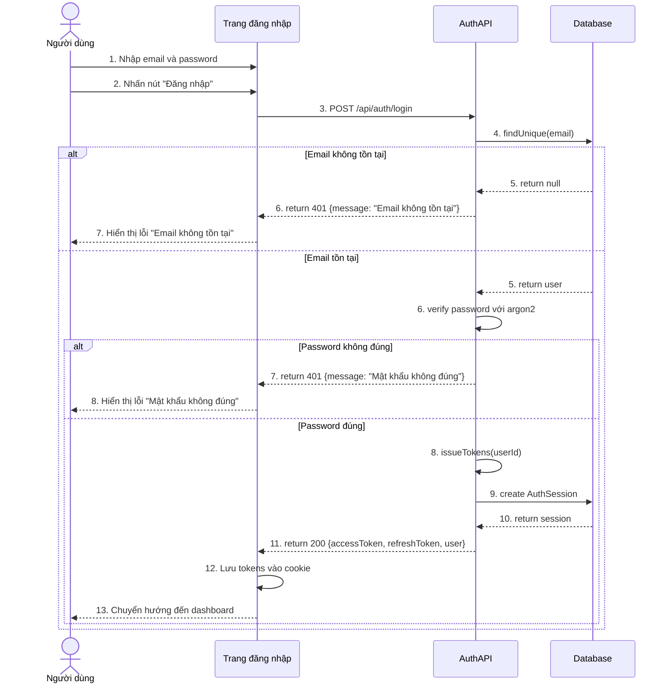
```mermaid
sequenceDiagram
    actor User as Người dùng
    participant Page as Trang đăng nhập
    participant API as AuthAPI
    participant DB as Database

    User->>Page: 1. Nhập email và password
    User->>Page: 2. Nhấn nút "Đăng nhập"
    Page->>API: 3. POST /api/auth/login
    API->>DB: 4. findUnique(email)

    alt Email không tồn tại
        DB-->>API: 5. return null
        API-->>Page: 6. return 401 {message: "Email không tồn tại"}
        Page-->>User: 7. Hiển thị lỗi "Email không tồn tại"
    else Email tồn tại
        DB-->>API: 5. return user
        API->>API: 6. verify password với argon2

        alt Password không đúng
            API-->>Page: 7. return 401 {message: "Mật khẩu không đúng"}
            Page-->>User: 8. Hiển thị lỗi "Mật khẩu không đúng"
        else Password đúng
            API->>API: 8. issueTokens(userId)
            API->>DB: 9. create AuthSession
            DB-->>API: 10. return session
            API-->>Page: 11. return 200 {accessToken, refreshToken, user}
            Page->>Page: 12. Lưu tokens vào cookie
            Page-->>User: 13. Chuyển hướng đến dashboard
        end
    end
```

## 2. Đăng ký (Register)

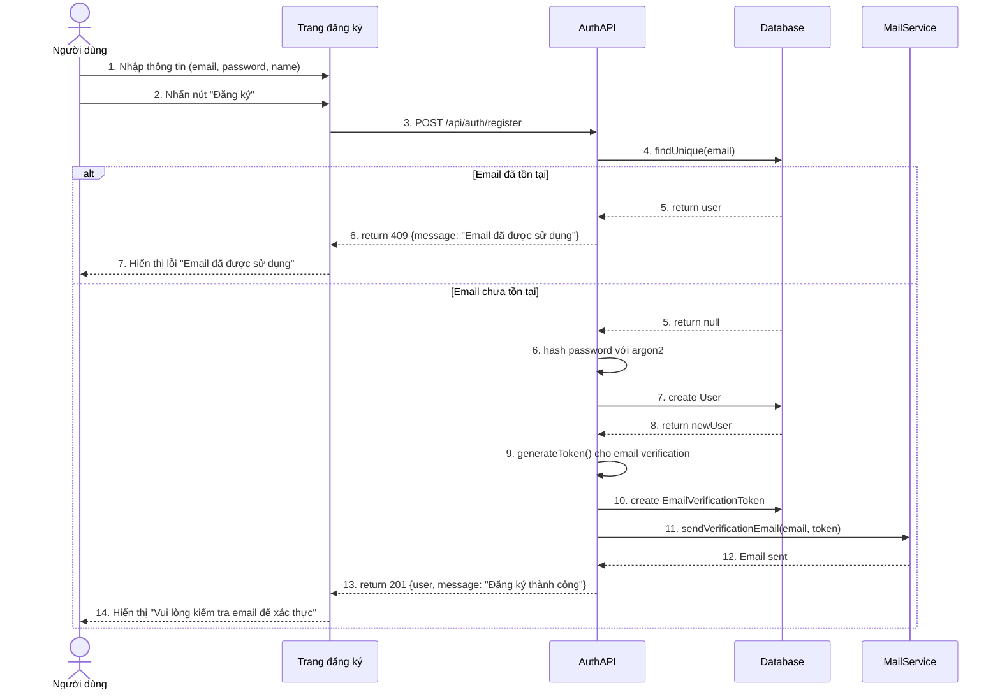
```mermaid
sequenceDiagram
    actor User as Người dùng
    participant Page as Trang đăng ký
    participant API as AuthAPI
    participant DB as Database
    participant Mail as MailService

    User->>Page: 1. Nhập thông tin (email, password, name)
    User->>Page: 2. Nhấn nút "Đăng ký"
    Page->>API: 3. POST /api/auth/register
    API->>DB: 4. findUnique(email)

    alt Email đã tồn tại
        DB-->>API: 5. return user
        API-->>Page: 6. return 409 {message: "Email đã được sử dụng"}
        Page-->>User: 7. Hiển thị lỗi "Email đã được sử dụng"
    else Email chưa tồn tại
        DB-->>API: 5. return null
        API->>API: 6. hash password với argon2
        API->>DB: 7. create User
        DB-->>API: 8. return newUser
        API->>API: 9. generateToken() cho email verification
        API->>DB: 10. create EmailVerificationToken
        API->>Mail: 11. sendVerificationEmail(email, token)
        Mail-->>API: 12. Email sent
        API-->>Page: 13. return 201 {user, message: "Đăng ký thành công"}
        Page-->>User: 14. Hiển thị "Vui lòng kiểm tra email để xác thực"
    end
```

## 3. Tạo món ăn (Create Menu Item)

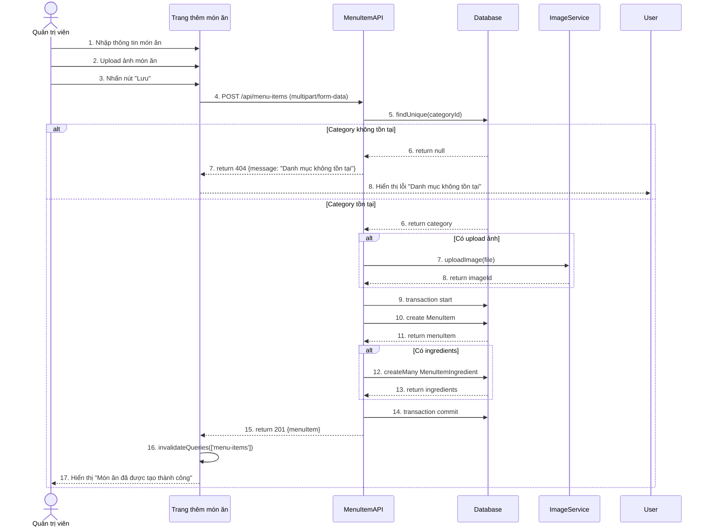
```mermaid
sequenceDiagram
    actor Admin as Quản trị viên
    participant Page as Trang thêm món ăn
    participant API as MenuItemAPI
    participant DB as Database
    participant Image as ImageService

    Admin->>Page: 1. Nhập thông tin món ăn
    Admin->>Page: 2. Upload ảnh món ăn
    Admin->>Page: 3. Nhấn nút "Lưu"
    Page->>API: 4. POST /api/menu-items (multipart/form-data)
    API->>DB: 5. findUnique(categoryId)

    alt Category không tồn tại
        DB-->>API: 6. return null
        API-->>Page: 7. return 404 {message: "Danh mục không tồn tại"}
        Page-->>User: 8. Hiển thị lỗi "Danh mục không tồn tại"
    else Category tồn tại
        DB-->>API: 6. return category

        alt Có upload ảnh
            API->>Image: 7. uploadImage(file)
            Image-->>API: 8. return imageId
        end

        API->>DB: 9. transaction start
        API->>DB: 10. create MenuItem
        DB-->>API: 11. return menuItem

        alt Có ingredients
            API->>DB: 12. createMany MenuItemIngredient
            DB-->>API: 13. return ingredients
        end

        API->>DB: 14. transaction commit
        API-->>Page: 15. return 201 {menuItem}
        Page->>Page: 16. invalidateQueries(['menu-items'])
        Page-->>Admin: 17. Hiển thị "Món ăn đã được tạo thành công"
    end
```

## 4. Cập nhật món ăn (Update Menu Item)

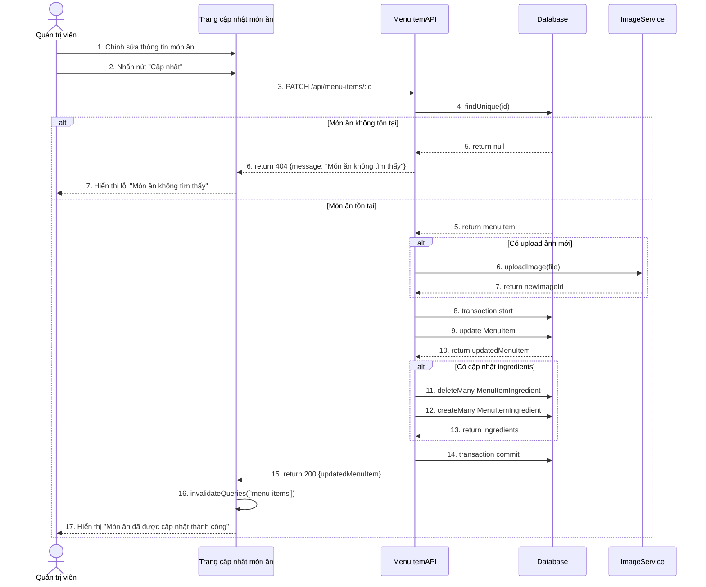
```mermaid
sequenceDiagram
    actor Admin as Quản trị viên
    participant Page as Trang cập nhật món ăn
    participant API as MenuItemAPI
    participant DB as Database
    participant Image as ImageService

    Admin->>Page: 1. Chỉnh sửa thông tin món ăn
    Admin->>Page: 2. Nhấn nút "Cập nhật"
    Page->>API: 3. PATCH /api/menu-items/:id
    API->>DB: 4. findUnique(id)

    alt Món ăn không tồn tại
        DB-->>API: 5. return null
        API-->>Page: 6. return 404 {message: "Món ăn không tìm thấy"}
        Page-->>Admin: 7. Hiển thị lỗi "Món ăn không tìm thấy"
    else Món ăn tồn tại
        DB-->>API: 5. return menuItem

        alt Có upload ảnh mới
            API->>Image: 6. uploadImage(file)
            Image-->>API: 7. return newImageId
        end

        API->>DB: 8. transaction start
        API->>DB: 9. update MenuItem
        DB-->>API: 10. return updatedMenuItem

        alt Có cập nhật ingredients
            API->>DB: 11. deleteMany MenuItemIngredient
            API->>DB: 12. createMany MenuItemIngredient
            DB-->>API: 13. return ingredients
        end

        API->>DB: 14. transaction commit
        API-->>Page: 15. return 200 {updatedMenuItem}
        Page->>Page: 16. invalidateQueries(['menu-items'])
        Page-->>Admin: 17. Hiển thị "Món ăn đã được cập nhật thành công"
    end
```

## 5. Tạo đơn hàng (Create Order)

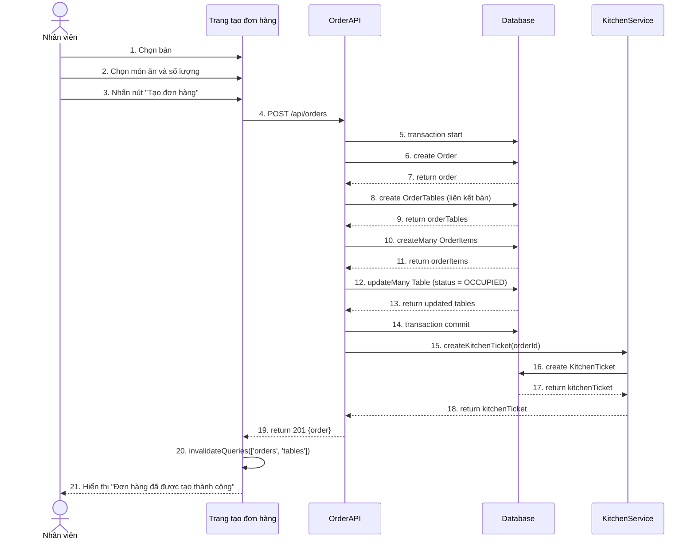
```mermaid
sequenceDiagram
    actor Staff as Nhân viên
    participant Page as Trang tạo đơn hàng
    participant API as OrderAPI
    participant DB as Database
    participant Kitchen as KitchenService

    Staff->>Page: 1. Chọn bàn
    Staff->>Page: 2. Chọn món ăn và số lượng
    Staff->>Page: 3. Nhấn nút "Tạo đơn hàng"
    Page->>API: 4. POST /api/orders
    API->>DB: 5. transaction start

    API->>DB: 6. create Order
    DB-->>API: 7. return order

    API->>DB: 8. create OrderTables (liên kết bàn)
    DB-->>API: 9. return orderTables

    API->>DB: 10. createMany OrderItems
    DB-->>API: 11. return orderItems

    API->>DB: 12. updateMany Table (status = OCCUPIED)
    DB-->>API: 13. return updated tables

    API->>DB: 14. transaction commit

    API->>Kitchen: 15. createKitchenTicket(orderId)
    Kitchen->>DB: 16. create KitchenTicket
    DB-->>Kitchen: 17. return kitchenTicket
    Kitchen-->>API: 18. return kitchenTicket

    API-->>Page: 19. return 201 {order}
    Page->>Page: 20. invalidateQueries(['orders', 'tables'])
    Page-->>Staff: 21. Hiển thị "Đơn hàng đã được tạo thành công"
```

## 6. Đặt bàn (Create Booking)

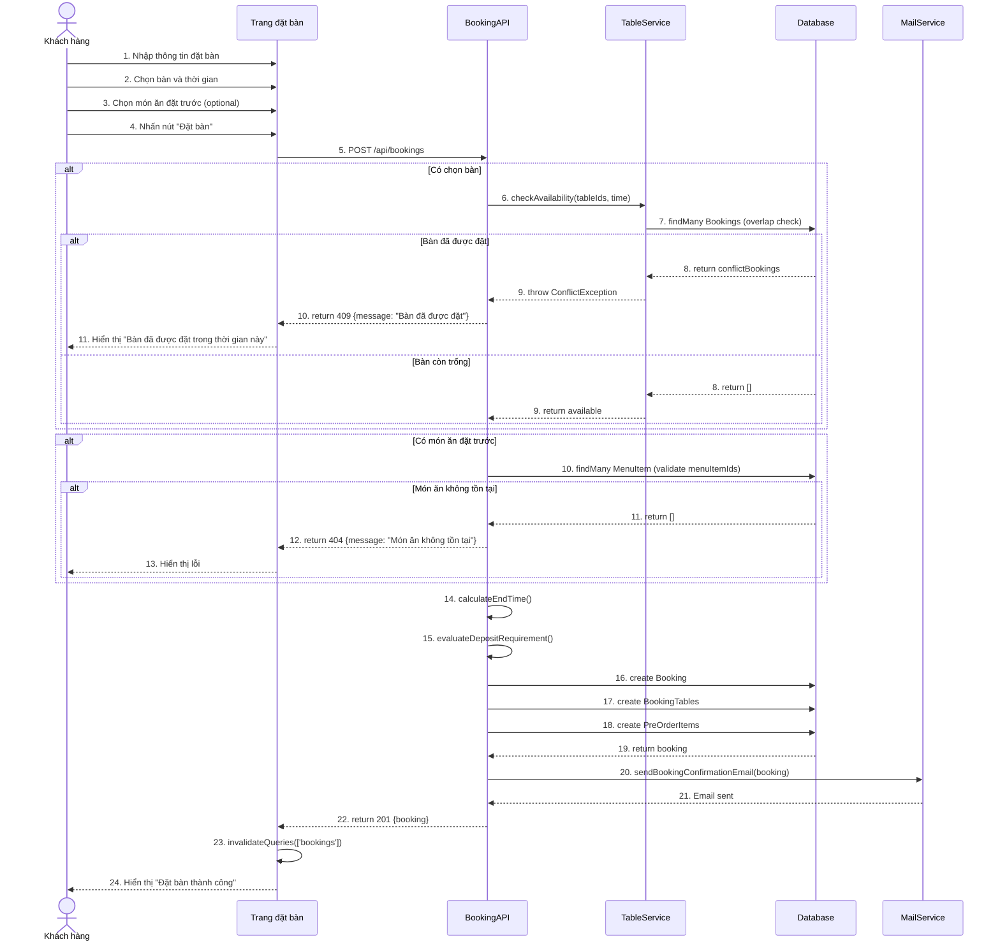
```mermaid
sequenceDiagram
    actor Customer as Khách hàng
    participant Page as Trang đặt bàn
    participant API as BookingAPI
    participant TableService as TableService
    participant DB as Database
    participant Mail as MailService

    Customer->>Page: 1. Nhập thông tin đặt bàn
    Customer->>Page: 2. Chọn bàn và thời gian
    Customer->>Page: 3. Chọn món ăn đặt trước (optional)
    Customer->>Page: 4. Nhấn nút "Đặt bàn"
    Page->>API: 5. POST /api/bookings

    alt Có chọn bàn
        API->>TableService: 6. checkAvailability(tableIds, time)
        TableService->>DB: 7. findMany Bookings (overlap check)

        alt Bàn đã được đặt
            DB-->>TableService: 8. return conflictBookings
            TableService-->>API: 9. throw ConflictException
            API-->>Page: 10. return 409 {message: "Bàn đã được đặt"}
            Page-->>Customer: 11. Hiển thị "Bàn đã được đặt trong thời gian này"
        else Bàn còn trống
            DB-->>TableService: 8. return []
            TableService-->>API: 9. return available
        end
    end

    alt Có món ăn đặt trước
        API->>DB: 10. findMany MenuItem (validate menuItemIds)

        alt Món ăn không tồn tại
            DB-->>API: 11. return []
            API-->>Page: 12. return 404 {message: "Món ăn không tồn tại"}
            Page-->>Customer: 13. Hiển thị lỗi
        end
    end

    API->>API: 14. calculateEndTime()
    API->>API: 15. evaluateDepositRequirement()

    API->>DB: 16. create Booking
    API->>DB: 17. create BookingTables
    API->>DB: 18. create PreOrderItems
    DB-->>API: 19. return booking

    API->>Mail: 20. sendBookingConfirmationEmail(booking)
    Mail-->>API: 21. Email sent

    API-->>Page: 22. return 201 {booking}
    Page->>Page: 23. invalidateQueries(['bookings'])
    Page-->>Customer: 24. Hiển thị "Đặt bàn thành công"
```

## 7. Thanh toán đặt cọc qua VNPay (Deposit Payment)

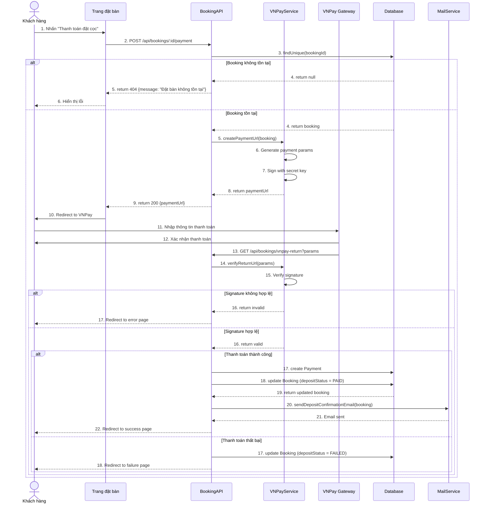
```mermaid
sequenceDiagram
    actor Customer as Khách hàng
    participant Page as Trang đặt bàn
    participant API as BookingAPI
    participant VNPay as VNPayService
    participant PaymentGateway as VNPay Gateway
    participant DB as Database
    participant Mail as MailService

    Customer->>Page: 1. Nhấn "Thanh toán đặt cọc"
    Page->>API: 2. POST /api/bookings/:id/payment
    API->>DB: 3. findUnique(bookingId)

    alt Booking không tồn tại
        DB-->>API: 4. return null
        API-->>Page: 5. return 404 {message: "Đặt bàn không tồn tại"}
        Page-->>Customer: 6. Hiển thị lỗi
    else Booking tồn tại
        DB-->>API: 4. return booking
        API->>VNPay: 5. createPaymentUrl(booking)
        VNPay->>VNPay: 6. Generate payment params
        VNPay->>VNPay: 7. Sign with secret key
        VNPay-->>API: 8. return paymentUrl
        API-->>Page: 9. return 200 {paymentUrl}
        Page->>Customer: 10. Redirect to VNPay
        Customer->>PaymentGateway: 11. Nhập thông tin thanh toán
        PaymentGateway->>Customer: 12. Xác nhận thanh toán
        PaymentGateway->>API: 13. GET /api/bookings/vnpay-return?params

        API->>VNPay: 14. verifyReturnUrl(params)
        VNPay->>VNPay: 15. Verify signature

        alt Signature không hợp lệ
            VNPay-->>API: 16. return invalid
            API-->>Customer: 17. Redirect to error page
        else Signature hợp lệ
            VNPay-->>API: 16. return valid

            alt Thanh toán thành công
                API->>DB: 17. create Payment
                API->>DB: 18. update Booking (depositStatus = PAID)
                DB-->>API: 19. return updated booking
                API->>Mail: 20. sendDepositConfirmationEmail(booking)
                Mail-->>API: 21. Email sent
                API-->>Customer: 22. Redirect to success page
            else Thanh toán thất bại
                API->>DB: 17. update Booking (depositStatus = FAILED)
                API-->>Customer: 18. Redirect to failure page
            end
        end
    end
```

## 8. Hoàn thành đơn hàng và thanh toán (Complete Order)

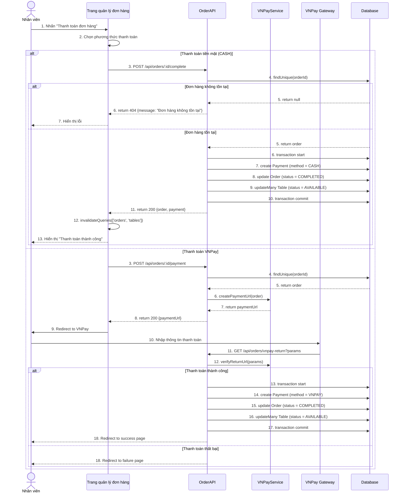
```mermaid
sequenceDiagram
    actor Staff as Nhân viên
    participant Page as Trang quản lý đơn hàng
    participant API as OrderAPI
    participant VNPay as VNPayService
    participant PaymentGateway as VNPay Gateway
    participant DB as Database

    Staff->>Page: 1. Nhấn "Thanh toán đơn hàng"
    Page->>Page: 2. Chọn phương thức thanh toán

    alt Thanh toán tiền mặt (CASH)
        Page->>API: 3. POST /api/orders/:id/complete
        API->>DB: 4. findUnique(orderId)

        alt Đơn hàng không tồn tại
            DB-->>API: 5. return null
            API-->>Page: 6. return 404 {message: "Đơn hàng không tồn tại"}
            Page-->>Staff: 7. Hiển thị lỗi
        else Đơn hàng tồn tại
            DB-->>API: 5. return order
            API->>DB: 6. transaction start
            API->>DB: 7. create Payment (method = CASH)
            API->>DB: 8. update Order (status = COMPLETED)
            API->>DB: 9. updateMany Table (status = AVAILABLE)
            API->>DB: 10. transaction commit
            API-->>Page: 11. return 200 {order, payment}
            Page->>Page: 12. invalidateQueries(['orders', 'tables'])
            Page-->>Staff: 13. Hiển thị "Thanh toán thành công"
        end
    else Thanh toán VNPay
        Page->>API: 3. POST /api/orders/:id/payment
        API->>DB: 4. findUnique(orderId)
        DB-->>API: 5. return order
        API->>VNPay: 6. createPaymentUrl(order)
        VNPay-->>API: 7. return paymentUrl
        API-->>Page: 8. return 200 {paymentUrl}
        Page->>Staff: 9. Redirect to VNPay
        Staff->>PaymentGateway: 10. Nhập thông tin thanh toán
        PaymentGateway->>API: 11. GET /api/orders/vnpay-return?params
        API->>VNPay: 12. verifyReturnUrl(params)

        alt Thanh toán thành công
            API->>DB: 13. transaction start
            API->>DB: 14. create Payment (method = VNPAY)
            API->>DB: 15. update Order (status = COMPLETED)
            API->>DB: 16. updateMany Table (status = AVAILABLE)
            API->>DB: 17. transaction commit
            API-->>Staff: 18. Redirect to success page
        else Thanh toán thất bại
            API-->>Staff: 18. Redirect to failure page
        end
    end
```

## 9. Tạo phiếu bếp (Create Kitchen Ticket)

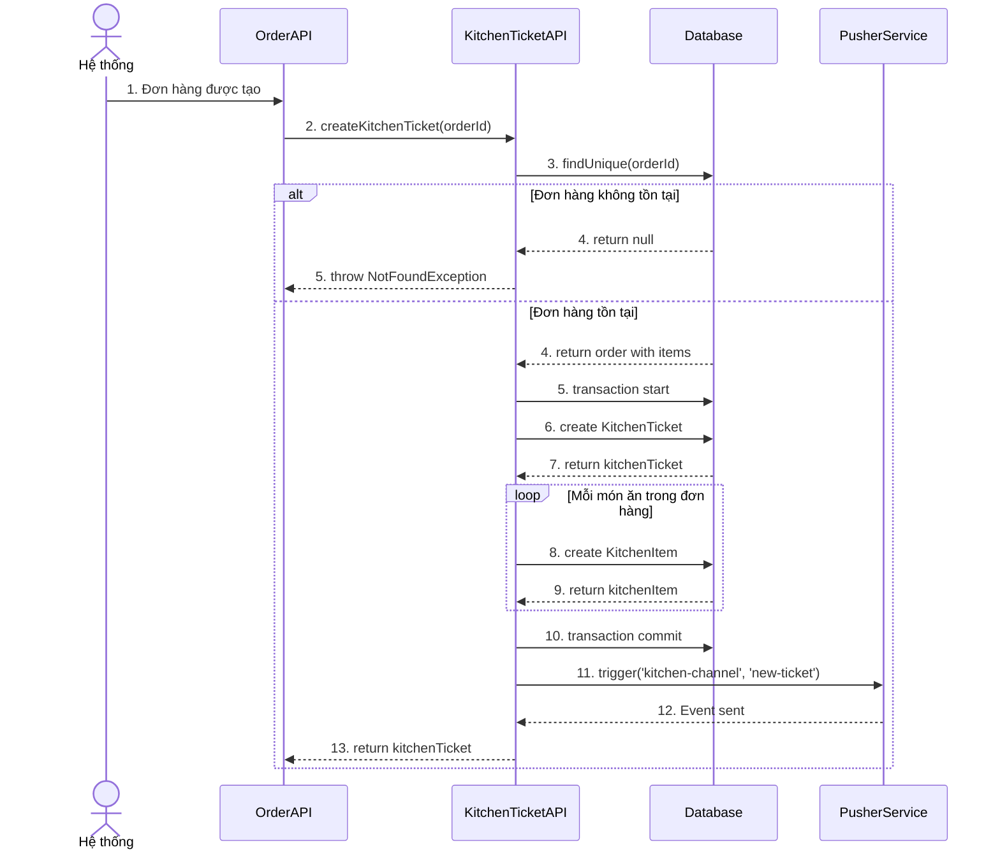
```mermaid
sequenceDiagram
    actor System as Hệ thống
    participant OrderAPI as OrderAPI
    participant KitchenAPI as KitchenTicketAPI
    participant DB as Database
    participant Pusher as PusherService

    System->>OrderAPI: 1. Đơn hàng được tạo
    OrderAPI->>KitchenAPI: 2. createKitchenTicket(orderId)
    KitchenAPI->>DB: 3. findUnique(orderId)

    alt Đơn hàng không tồn tại
        DB-->>KitchenAPI: 4. return null
        KitchenAPI-->>OrderAPI: 5. throw NotFoundException
    else Đơn hàng tồn tại
        DB-->>KitchenAPI: 4. return order with items
        KitchenAPI->>DB: 5. transaction start

        KitchenAPI->>DB: 6. create KitchenTicket
        DB-->>KitchenAPI: 7. return kitchenTicket

        loop Mỗi món ăn trong đơn hàng
            KitchenAPI->>DB: 8. create KitchenItem
            DB-->>KitchenAPI: 9. return kitchenItem
        end

        KitchenAPI->>DB: 10. transaction commit

        KitchenAPI->>Pusher: 11. trigger('kitchen-channel', 'new-ticket')
        Pusher-->>KitchenAPI: 12. Event sent

        KitchenAPI-->>OrderAPI: 13. return kitchenTicket
    end
```

## 10. Cập nhật trạng thái món ăn trong bếp (Update Kitchen Item Status)

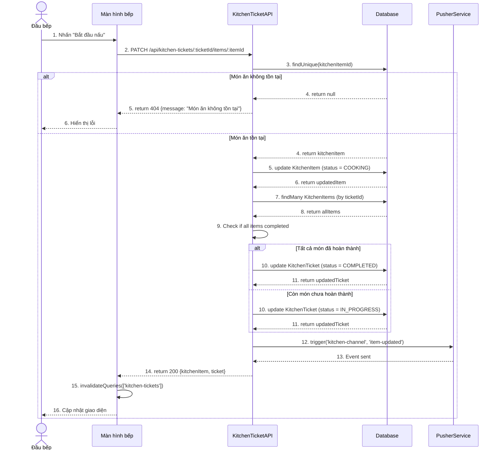
```mermaid
sequenceDiagram
    actor Chef as Đầu bếp
    participant Page as Màn hình bếp
    participant API as KitchenTicketAPI
    participant DB as Database
    participant Pusher as PusherService

    Chef->>Page: 1. Nhấn "Bắt đầu nấu"
    Page->>API: 2. PATCH /api/kitchen-tickets/:ticketId/items/:itemId
    API->>DB: 3. findUnique(kitchenItemId)

    alt Món ăn không tồn tại
        DB-->>API: 4. return null
        API-->>Page: 5. return 404 {message: "Món ăn không tồn tại"}
        Page-->>Chef: 6. Hiển thị lỗi
    else Món ăn tồn tại
        DB-->>API: 4. return kitchenItem
        API->>DB: 5. update KitchenItem (status = COOKING)
        DB-->>API: 6. return updatedItem

        API->>DB: 7. findMany KitchenItems (by ticketId)
        DB-->>API: 8. return allItems

        API->>API: 9. Check if all items completed

        alt Tất cả món đã hoàn thành
            API->>DB: 10. update KitchenTicket (status = COMPLETED)
            DB-->>API: 11. return updatedTicket
        else Còn món chưa hoàn thành
            API->>DB: 10. update KitchenTicket (status = IN_PROGRESS)
            DB-->>API: 11. return updatedTicket
        end

        API->>Pusher: 12. trigger('kitchen-channel', 'item-updated')
        Pusher-->>API: 13. Event sent

        API-->>Page: 14. return 200 {kitchenItem, ticket}
        Page->>Page: 15. invalidateQueries(['kitchen-tickets'])
        Page-->>Chef: 16. Cập nhật giao diện
    end
```

## 11. Quản lý bàn - Kiểm tra bàn trống (Check Table Availability)

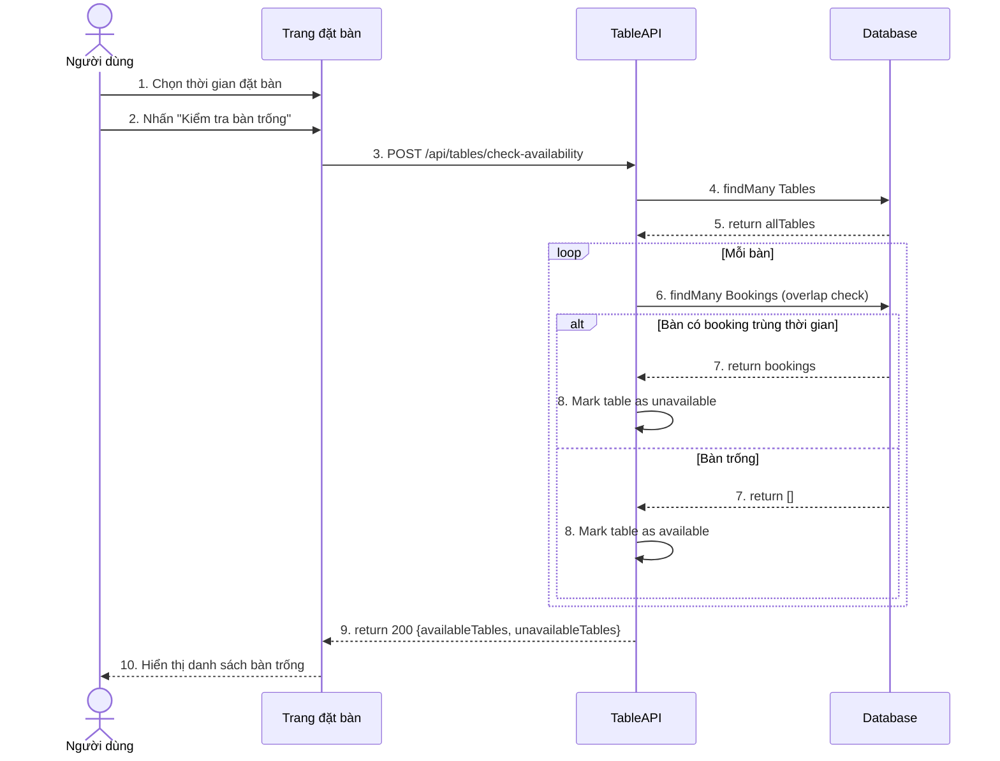
```mermaid
sequenceDiagram
    actor User as Người dùng
    participant Page as Trang đặt bàn
    participant API as TableAPI
    participant DB as Database

    User->>Page: 1. Chọn thời gian đặt bàn
    User->>Page: 2. Nhấn "Kiểm tra bàn trống"
    Page->>API: 3. POST /api/tables/check-availability
    API->>DB: 4. findMany Tables
    DB-->>API: 5. return allTables

    loop Mỗi bàn
        API->>DB: 6. findMany Bookings (overlap check)

        alt Bàn có booking trùng thời gian
            DB-->>API: 7. return bookings
            API->>API: 8. Mark table as unavailable
        else Bàn trống
            DB-->>API: 7. return []
            API->>API: 8. Mark table as available
        end
    end

    API-->>Page: 9. return 200 {availableTables, unavailableTables}
    Page-->>User: 10. Hiển thị danh sách bàn trống
```

## 12. Tạo danh mục món ăn (Create Menu Category)

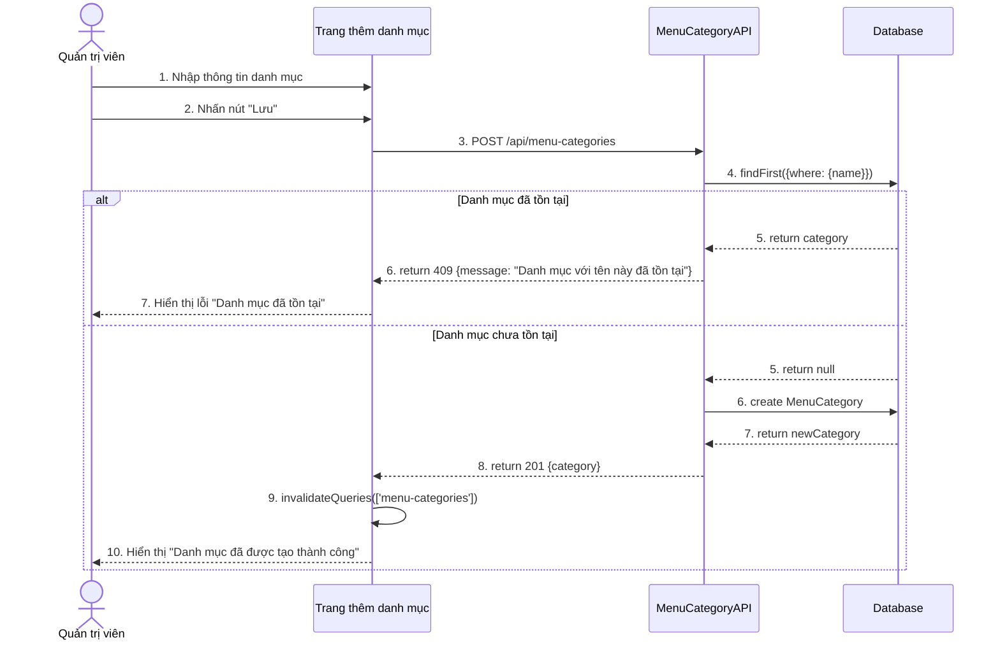
```mermaid
sequenceDiagram
    actor Admin as Quản trị viên
    participant Page as Trang thêm danh mục
    participant API as MenuCategoryAPI
    participant DB as Database

    Admin->>Page: 1. Nhập thông tin danh mục
    Admin->>Page: 2. Nhấn nút "Lưu"
    Page->>API: 3. POST /api/menu-categories
    API->>DB: 4. findFirst({where: {name}})

    alt Danh mục đã tồn tại
        DB-->>API: 5. return category
        API-->>Page: 6. return 409 {message: "Danh mục với tên này đã tồn tại"}
        Page-->>Admin: 7. Hiển thị lỗi "Danh mục đã tồn tại"
    else Danh mục chưa tồn tại
        DB-->>API: 5. return null
        API->>DB: 6. create MenuCategory
        DB-->>API: 7. return newCategory
        API-->>Page: 8. return 201 {category}
        Page->>Page: 9. invalidateQueries(['menu-categories'])
        Page-->>Admin: 10. Hiển thị "Danh mục đã được tạo thành công"
    end
```

## 13. Phân quyền - Gán quyền cho vai trò (Assign Permissions to Role)

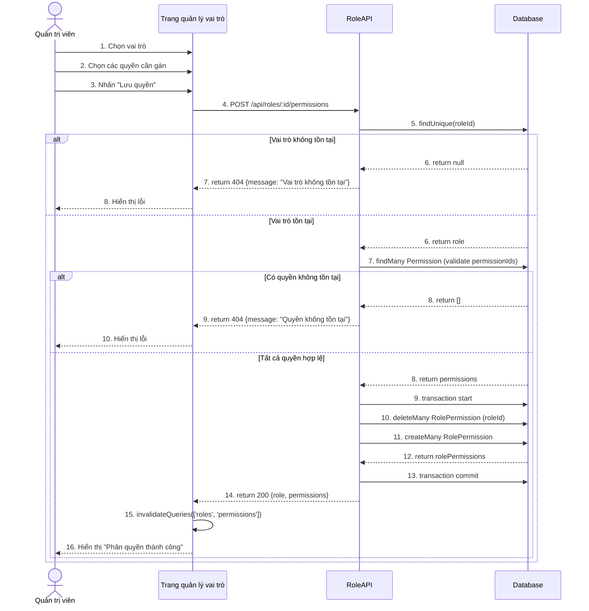
```mermaid
sequenceDiagram
    actor Admin as Quản trị viên
    participant Page as Trang quản lý vai trò
    participant API as RoleAPI
    participant DB as Database

    Admin->>Page: 1. Chọn vai trò
    Admin->>Page: 2. Chọn các quyền cần gán
    Admin->>Page: 3. Nhấn "Lưu quyền"
    Page->>API: 4. POST /api/roles/:id/permissions
    API->>DB: 5. findUnique(roleId)

    alt Vai trò không tồn tại
        DB-->>API: 6. return null
        API-->>Page: 7. return 404 {message: "Vai trò không tồn tại"}
        Page-->>Admin: 8. Hiển thị lỗi
    else Vai trò tồn tại
        DB-->>API: 6. return role

        API->>DB: 7. findMany Permission (validate permissionIds)

        alt Có quyền không tồn tại
            DB-->>API: 8. return []
            API-->>Page: 9. return 404 {message: "Quyền không tồn tại"}
            Page-->>Admin: 10. Hiển thị lỗi
        else Tất cả quyền hợp lệ
            DB-->>API: 8. return permissions
            API->>DB: 9. transaction start
            API->>DB: 10. deleteMany RolePermission (roleId)
            API->>DB: 11. createMany RolePermission
            DB-->>API: 12. return rolePermissions
            API->>DB: 13. transaction commit
            API-->>Page: 14. return 200 {role, permissions}
            Page->>Page: 15. invalidateQueries(['roles', 'permissions'])
            Page-->>Admin: 16. Hiển thị "Phân quyền thành công"
        end
    end
```

## 14. Gán vai trò cho người dùng (Assign Roles to User)

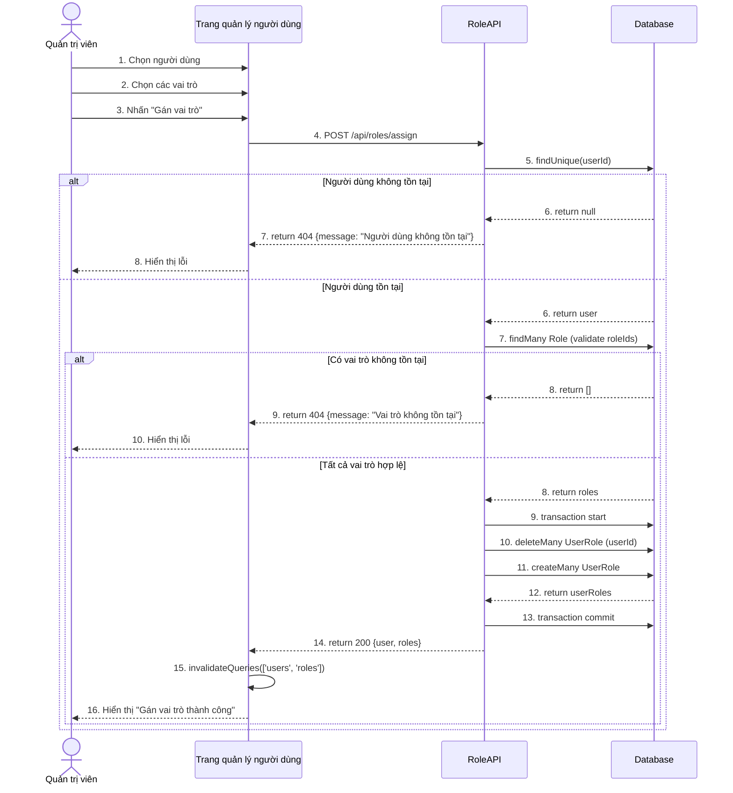
```mermaid
sequenceDiagram
    actor Admin as Quản trị viên
    participant Page as Trang quản lý người dùng
    participant API as RoleAPI
    participant DB as Database

    Admin->>Page: 1. Chọn người dùng
    Admin->>Page: 2. Chọn các vai trò
    Admin->>Page: 3. Nhấn "Gán vai trò"
    Page->>API: 4. POST /api/roles/assign
    API->>DB: 5. findUnique(userId)

    alt Người dùng không tồn tại
        DB-->>API: 6. return null
        API-->>Page: 7. return 404 {message: "Người dùng không tồn tại"}
        Page-->>Admin: 8. Hiển thị lỗi
    else Người dùng tồn tại
        DB-->>API: 6. return user
        API->>DB: 7. findMany Role (validate roleIds)

        alt Có vai trò không tồn tại
            DB-->>API: 8. return []
            API-->>Page: 9. return 404 {message: "Vai trò không tồn tại"}
            Page-->>Admin: 10. Hiển thị lỗi
        else Tất cả vai trò hợp lệ
            DB-->>API: 8. return roles
            API->>DB: 9. transaction start
            API->>DB: 10. deleteMany UserRole (userId)
            API->>DB: 11. createMany UserRole
            DB-->>API: 12. return userRoles
            API->>DB: 13. transaction commit
            API-->>Page: 14. return 200 {user, roles}
            Page->>Page: 15. invalidateQueries(['users', 'roles'])
            Page-->>Admin: 16. Hiển thị "Gán vai trò thành công"
        end
    end
```

## 15. Chấm công - Vào ca (Clock In)

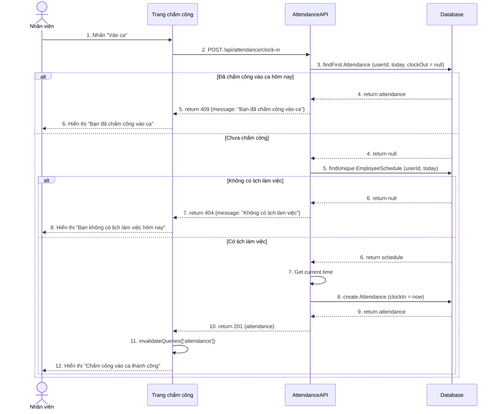
```mermaid
sequenceDiagram
    actor Employee as Nhân viên
    participant Page as Trang chấm công
    participant API as AttendanceAPI
    participant DB as Database

    Employee->>Page: 1. Nhấn "Vào ca"
    Page->>API: 2. POST /api/attendance/clock-in
    API->>DB: 3. findFirst Attendance (userId, today, clockOut = null)

    alt Đã chấm công vào ca hôm nay
        DB-->>API: 4. return attendance
        API-->>Page: 5. return 409 {message: "Bạn đã chấm công vào ca"}
        Page-->>Employee: 6. Hiển thị "Bạn đã chấm công vào ca"
    else Chưa chấm công
        DB-->>API: 4. return null
        API->>DB: 5. findUnique EmployeeSchedule (userId, today)

        alt Không có lịch làm việc
            DB-->>API: 6. return null
            API-->>Page: 7. return 404 {message: "Không có lịch làm việc"}
            Page-->>Employee: 8. Hiển thị "Bạn không có lịch làm việc hôm nay"
        else Có lịch làm việc
            DB-->>API: 6. return schedule
            API->>API: 7. Get current time
            API->>DB: 8. create Attendance (clockIn = now)
            DB-->>API: 9. return attendance
            API-->>Page: 10. return 201 {attendance}
            Page->>Page: 11. invalidateQueries(['attendance'])
            Page-->>Employee: 12. Hiển thị "Chấm công vào ca thành công"
        end
    end
```

## 16. Chấm công - Ra ca (Clock Out)

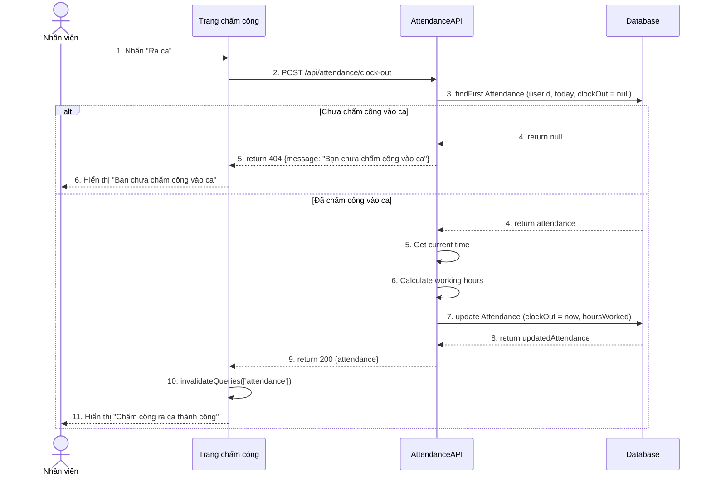
```mermaid
sequenceDiagram
    actor Employee as Nhân viên
    participant Page as Trang chấm công
    participant API as AttendanceAPI
    participant DB as Database

    Employee->>Page: 1. Nhấn "Ra ca"
    Page->>API: 2. POST /api/attendance/clock-out
    API->>DB: 3. findFirst Attendance (userId, today, clockOut = null)

    alt Chưa chấm công vào ca
        DB-->>API: 4. return null
        API-->>Page: 5. return 404 {message: "Bạn chưa chấm công vào ca"}
        Page-->>Employee: 6. Hiển thị "Bạn chưa chấm công vào ca"
    else Đã chấm công vào ca
        DB-->>API: 4. return attendance
        API->>API: 5. Get current time
        API->>API: 6. Calculate working hours
        API->>DB: 7. update Attendance (clockOut = now, hoursWorked)
        DB-->>API: 8. return updatedAttendance
        API-->>Page: 9. return 200 {attendance}
        Page->>Page: 10. invalidateQueries(['attendance'])
        Page-->>Employee: 11. Hiển thị "Chấm công ra ca thành công"
    end
```

## 17. Tạo ca làm việc (Create Shift)

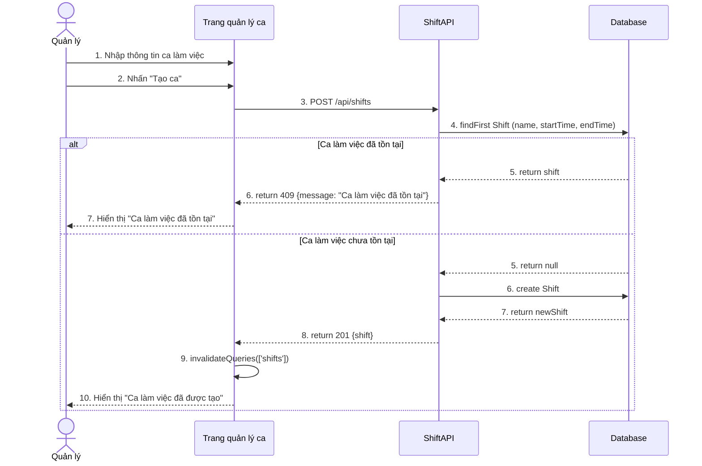
```mermaid
sequenceDiagram
    actor Manager as Quản lý
    participant Page as Trang quản lý ca
    participant API as ShiftAPI
    participant DB as Database

    Manager->>Page: 1. Nhập thông tin ca làm việc
    Manager->>Page: 2. Nhấn "Tạo ca"
    Page->>API: 3. POST /api/shifts
    API->>DB: 4. findFirst Shift (name, startTime, endTime)

    alt Ca làm việc đã tồn tại
        DB-->>API: 5. return shift
        API-->>Page: 6. return 409 {message: "Ca làm việc đã tồn tại"}
        Page-->>Manager: 7. Hiển thị "Ca làm việc đã tồn tại"
    else Ca làm việc chưa tồn tại
        DB-->>API: 5. return null
        API->>DB: 6. create Shift
        DB-->>API: 7. return newShift
        API-->>Page: 8. return 201 {shift}
        Page->>Page: 9. invalidateQueries(['shifts'])
        Page-->>Manager: 10. Hiển thị "Ca làm việc đã được tạo"
    end
```

## 18. Tạo lịch làm việc cho nhân viên (Create Employee Schedule)

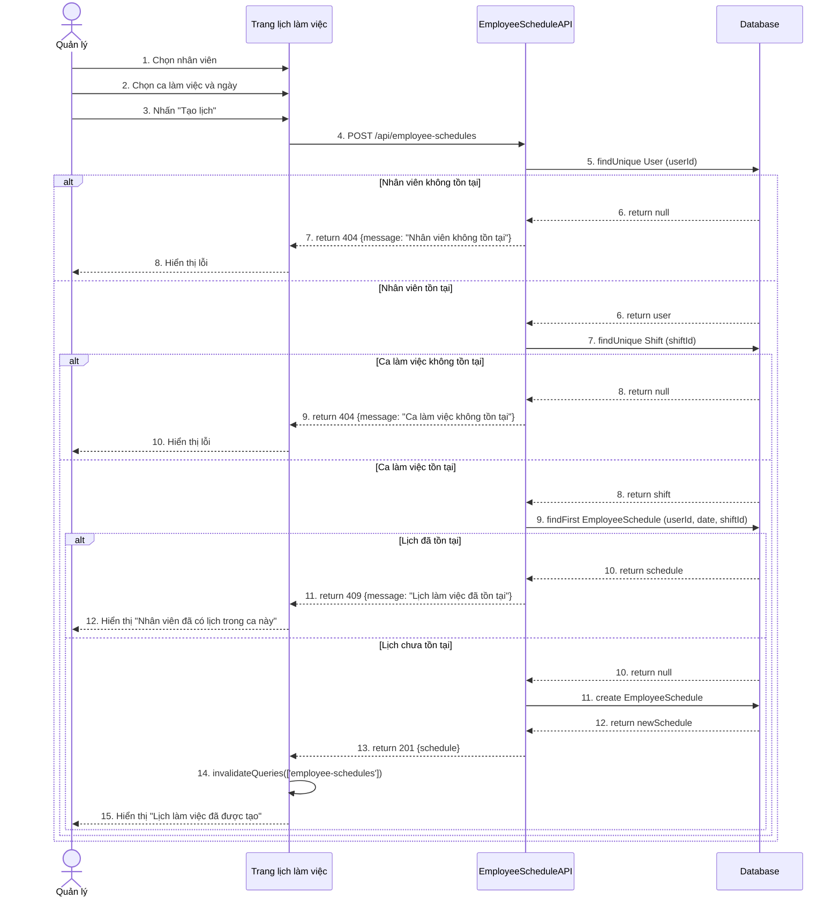
```mermaid
sequenceDiagram
    actor Manager as Quản lý
    participant Page as Trang lịch làm việc
    participant API as EmployeeScheduleAPI
    participant DB as Database

    Manager->>Page: 1. Chọn nhân viên
    Manager->>Page: 2. Chọn ca làm việc và ngày
    Manager->>Page: 3. Nhấn "Tạo lịch"
    Page->>API: 4. POST /api/employee-schedules
    API->>DB: 5. findUnique User (userId)

    alt Nhân viên không tồn tại
        DB-->>API: 6. return null
        API-->>Page: 7. return 404 {message: "Nhân viên không tồn tại"}
        Page-->>Manager: 8. Hiển thị lỗi
    else Nhân viên tồn tại
        DB-->>API: 6. return user
        API->>DB: 7. findUnique Shift (shiftId)

        alt Ca làm việc không tồn tại
            DB-->>API: 8. return null
            API-->>Page: 9. return 404 {message: "Ca làm việc không tồn tại"}
            Page-->>Manager: 10. Hiển thị lỗi
        else Ca làm việc tồn tại
            DB-->>API: 8. return shift
            API->>DB: 9. findFirst EmployeeSchedule (userId, date, shiftId)

            alt Lịch đã tồn tại
                DB-->>API: 10. return schedule
                API-->>Page: 11. return 409 {message: "Lịch làm việc đã tồn tại"}
                Page-->>Manager: 12. Hiển thị "Nhân viên đã có lịch trong ca này"
            else Lịch chưa tồn tại
                DB-->>API: 10. return null
                API->>DB: 11. create EmployeeSchedule
                DB-->>API: 12. return newSchedule
                API-->>Page: 13. return 201 {schedule}
                Page->>Page: 14. invalidateQueries(['employee-schedules'])
                Page-->>Manager: 15. Hiển thị "Lịch làm việc đã được tạo"
            end
        end
    end
```

## 19. Yêu cầu nghỉ phép (Create Time Off Request)

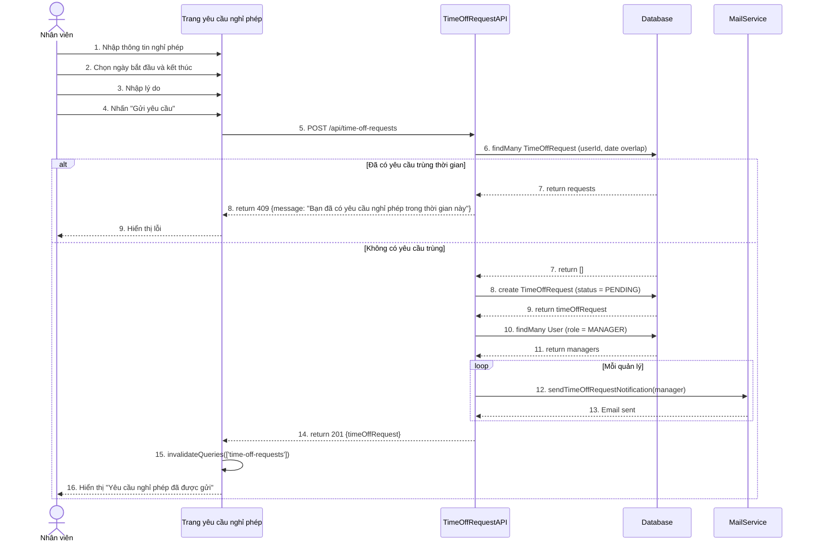
```mermaid
sequenceDiagram
    actor Employee as Nhân viên
    participant Page as Trang yêu cầu nghỉ phép
    participant API as TimeOffRequestAPI
    participant DB as Database
    participant Mail as MailService

    Employee->>Page: 1. Nhập thông tin nghỉ phép
    Employee->>Page: 2. Chọn ngày bắt đầu và kết thúc
    Employee->>Page: 3. Nhập lý do
    Employee->>Page: 4. Nhấn "Gửi yêu cầu"
    Page->>API: 5. POST /api/time-off-requests
    API->>DB: 6. findMany TimeOffRequest (userId, date overlap)

    alt Đã có yêu cầu trùng thời gian
        DB-->>API: 7. return requests
        API-->>Page: 8. return 409 {message: "Bạn đã có yêu cầu nghỉ phép trong thời gian này"}
        Page-->>Employee: 9. Hiển thị lỗi
    else Không có yêu cầu trùng
        DB-->>API: 7. return []
        API->>DB: 8. create TimeOffRequest (status = PENDING)
        DB-->>API: 9. return timeOffRequest

        API->>DB: 10. findMany User (role = MANAGER)
        DB-->>API: 11. return managers

        loop Mỗi quản lý
            API->>Mail: 12. sendTimeOffRequestNotification(manager)
            Mail-->>API: 13. Email sent
        end

        API-->>Page: 14. return 201 {timeOffRequest}
        Page->>Page: 15. invalidateQueries(['time-off-requests'])
        Page-->>Employee: 16. Hiển thị "Yêu cầu nghỉ phép đã được gửi"
    end
```

## 20. Duyệt yêu cầu nghỉ phép (Approve Time Off Request)

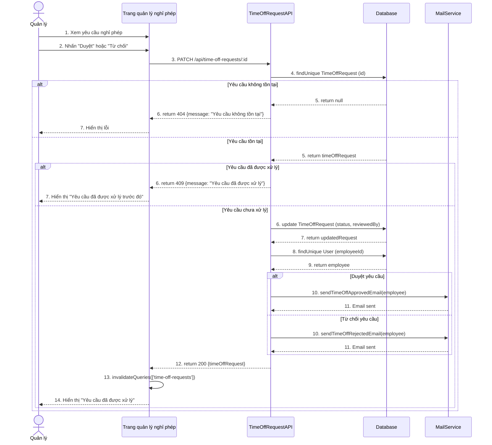
```mermaid
sequenceDiagram
    actor Manager as Quản lý
    participant Page as Trang quản lý nghỉ phép
    participant API as TimeOffRequestAPI
    participant DB as Database
    participant Mail as MailService

    Manager->>Page: 1. Xem yêu cầu nghỉ phép
    Manager->>Page: 2. Nhấn "Duyệt" hoặc "Từ chối"
    Page->>API: 3. PATCH /api/time-off-requests/:id
    API->>DB: 4. findUnique TimeOffRequest (id)

    alt Yêu cầu không tồn tại
        DB-->>API: 5. return null
        API-->>Page: 6. return 404 {message: "Yêu cầu không tồn tại"}
        Page-->>Manager: 7. Hiển thị lỗi
    else Yêu cầu tồn tại
        DB-->>API: 5. return timeOffRequest

        alt Yêu cầu đã được xử lý
            API-->>Page: 6. return 409 {message: "Yêu cầu đã được xử lý"}
            Page-->>Manager: 7. Hiển thị "Yêu cầu đã được xử lý trước đó"
        else Yêu cầu chưa xử lý
            API->>DB: 6. update TimeOffRequest (status, reviewedBy)
            DB-->>API: 7. return updatedRequest

            API->>DB: 8. findUnique User (employeeId)
            DB-->>API: 9. return employee

            alt Duyệt yêu cầu
                API->>Mail: 10. sendTimeOffApprovedEmail(employee)
                Mail-->>API: 11. Email sent
            else Từ chối yêu cầu
                API->>Mail: 10. sendTimeOffRejectedEmail(employee)
                Mail-->>API: 11. Email sent
            end

            API-->>Page: 12. return 200 {timeOffRequest}
            Page->>Page: 13. invalidateQueries(['time-off-requests'])
            Page-->>Manager: 14. Hiển thị "Yêu cầu đã được xử lý"
        end
    end
```

## 21. Gửi liên hệ (Submit Contact Form)

```mermaid
sequenceDiagram
    actor Customer as Khách hàng
    participant Page as Trang liên hệ
    participant API as ContactAPI
    participant DB as Database
    participant Mail as MailService

    Customer->>Page: 1. Nhập thông tin liên hệ
    Customer->>Page: 2. Nhập nội dung
    Customer->>Page: 3. Nhấn "Gửi"
    Page->>API: 4. POST /api/contacts
    API->>DB: 5. create Contact (status = PENDING)
    DB-->>API: 6. return contact

    API->>DB: 7. findMany User (role = ADMIN)
    DB-->>API: 8. return admins

    loop Mỗi admin
        API->>Mail: 9. sendNewContactNotification(admin, contact)
        Mail-->>API: 10. Email sent
    end

    API->>Mail: 11. sendContactConfirmationEmail(customer)
    Mail-->>API: 12. Email sent

    API-->>Page: 13. return 201 {contact}
    Page-->>Customer: 14. Hiển thị "Cảm ơn bạn đã liên hệ. Chúng tôi sẽ phản hồi sớm"
```

## 22. Tạo tin tức (Create News)

```mermaid
sequenceDiagram
    actor Admin as Quản trị viên
    participant Page as Trang tạo tin tức
    participant API as NewsAPI
    participant DB as Database
    participant Image as ImageService

    Admin->>Page: 1. Nhập tiêu đề và nội dung
    Admin->>Page: 2. Upload ảnh đại diện
    Admin->>Page: 3. Nhấn "Xuất bản"
    Page->>API: 4. POST /api/news

    alt Có upload ảnh
        API->>Image: 5. uploadImage(file)
        Image-->>API: 6. return imageId
    end

    API->>DB: 7. create News
    DB-->>API: 8. return news
    API-->>Page: 9. return 201 {news}
    Page->>Page: 10. invalidateQueries(['news'])
    Page-->>Admin: 11. Hiển thị "Tin tức đã được xuất bản"
```

## 23. Xác thực email (Verify Email)

```mermaid
sequenceDiagram
    actor User as Người dùng
    participant Email as Email Client
    participant Page as Trang xác thực
    participant API as AuthAPI
    participant DB as Database

    User->>Email: 1. Mở email xác thực
    User->>Email: 2. Click vào link xác thực
    Email->>Page: 3. Redirect to /verify-email?token=xxx
    Page->>API: 4. POST /api/auth/verify-email
    API->>DB: 5. findFirst EmailVerificationToken (token)

    alt Token không tồn tại
        DB-->>API: 6. return null
        API-->>Page: 7. return 404 {message: "Token không hợp lệ"}
        Page-->>User: 8. Hiển thị "Link xác thực không hợp lệ"
    else Token tồn tại
        DB-->>API: 6. return verificationToken
        API->>API: 7. Check token expiration

        alt Token đã hết hạn
            API-->>Page: 8. return 400 {message: "Token đã hết hạn"}
            Page-->>User: 9. Hiển thị "Link đã hết hạn. Vui lòng yêu cầu gửi lại"
        else Token còn hiệu lực
            API->>DB: 8. transaction start
            API->>DB: 9. update User (emailVerified = true)
            API->>DB: 10. delete EmailVerificationToken
            API->>DB: 11. transaction commit
            API-->>Page: 12. return 200 {message: "Email đã được xác thực"}
            Page-->>User: 13. Hiển thị "Email đã được xác thực thành công"
            Page->>Page: 14. Redirect to login page
        end
    end
```

## 24. Quên mật khẩu (Forgot Password)

```mermaid
sequenceDiagram
    actor User as Người dùng
    participant Page as Trang quên mật khẩu
    participant API as AuthAPI
    participant DB as Database
    participant Mail as MailService

    User->>Page: 1. Nhập email
    User->>Page: 2. Nhấn "Gửi link đặt lại mật khẩu"
    Page->>API: 3. POST /api/auth/forgot-password
    API->>DB: 4. findUnique User (email)

    alt Email không tồn tại
        DB-->>API: 5. return null
        API-->>Page: 6. return 200 {message: "Nếu email tồn tại..."}
        Page-->>User: 7. Hiển thị "Vui lòng kiểm tra email"
    else Email tồn tại
        DB-->>API: 5. return user
        API->>API: 6. generateToken()
        API->>API: 7. hash token with sha256
        API->>DB: 8. delete old PasswordResetToken (userId)
        API->>DB: 9. create PasswordResetToken (expires in 30 min)
        DB-->>API: 10. return resetToken
        API->>Mail: 11. sendPasswordResetEmail(email, token)
        Mail-->>API: 12. Email sent
        API-->>Page: 13. return 200 {message: "Email đã được gửi"}
        Page-->>User: 14. Hiển thị "Vui lòng kiểm tra email để đặt lại mật khẩu"
    end
```

## 25. Đặt lại mật khẩu (Reset Password)

```mermaid
sequenceDiagram
    actor User as Người dùng
    participant Email as Email Client
    participant Page as Trang đặt lại mật khẩu
    participant API as AuthAPI
    participant DB as Database

    User->>Email: 1. Mở email đặt lại mật khẩu
    User->>Email: 2. Click vào link
    Email->>Page: 3. Redirect to /reset-password?token=xxx
    User->>Page: 4. Nhập mật khẩu mới
    User->>Page: 5. Nhấn "Đặt lại mật khẩu"
    Page->>API: 6. POST /api/auth/reset-password
    API->>API: 7. hash token with sha256
    API->>DB: 8. findFirst PasswordResetToken (hashedToken)

    alt Token không tồn tại
        DB-->>API: 9. return null
        API-->>Page: 10. return 404 {message: "Token không hợp lệ"}
        Page-->>User: 11. Hiển thị "Link không hợp lệ"
    else Token tồn tại
        DB-->>API: 9. return resetToken
        API->>API: 10. Check token expiration

        alt Token đã hết hạn
            API->>DB: 11. delete PasswordResetToken
            API-->>Page: 12. return 400 {message: "Token đã hết hạn"}
            Page-->>User: 13. Hiển thị "Link đã hết hạn"
        else Token còn hiệu lực
            API->>API: 11. hash new password with argon2
            API->>DB: 12. transaction start
            API->>DB: 13. update User (password)
            API->>DB: 14. delete PasswordResetToken
            API->>DB: 15. deleteMany AuthSession (userId)
            API->>DB: 16. transaction commit
            API-->>Page: 17. return 200 {message: "Mật khẩu đã được đặt lại"}
            Page-->>User: 18. Hiển thị "Mật khẩu đã được đặt lại thành công"
            Page->>Page: 19. Redirect to login page
        end
    end
```
